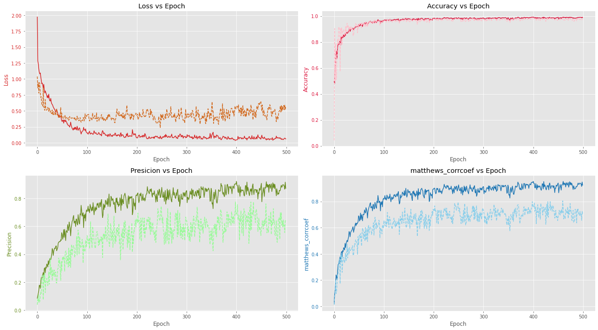

# DataProfesor_community_project

Community project to find molecules with activity against B-lactamase which is an enzyme important for bacteria resistance against antibiotics. The project is proposed by Chanin Nantasenamat ([dataprofessor](https://www.youtube.com/channel/UCV8e2g4IWQqK71bbzGDEI4Q)).

In this analisys I re-downloaded the files from ChEMBL and analyzed them since it was difficult to work with the original data. pChEMBL value by its own was not enough to split the data in active and inactive molecules, so after a search in the web I found a preprocessing pipeline that requires some fields not given in the original csv files.

The file called **MERGED_lactamase_community_project.ipynb** is the merge of all the files numbered. The file represents the sequential steps used in the preprocessing. It is my first project of this kind of work and basically, I'm new in cheminformatics and ML, so if you find and error in my preprocessing, I would appreciate you to start and issue.

## Data directly download from ChEMBL

After several try's, I found impossible to train a model with the given data, so I downloaded directly from the ChEMBL. After that, I tried to do the same as with the files given by the Data Profesor, but I did not success too. By reading in literature i found a pipeline where the first split into actives and inactives was given by a particular column called _Comment_.

Using that column was usefull since the active and inactve molecules labeled by the _Comment_ column do not follow the pChEMBL value, as presented in the next table.

|               |            | Mean pChEMBL Value | Mean Standard Value |
| ------------- | ---------- | ------------------ | ------------------- |
| Standard Type | Comment    |                    |                     |
| Potency       | Active     | 4.601975           | 37869.515924        |
|               | Not Active | 4.978202           | 37462.626052        |

As actives and inactives have overlaping means, it would be dificult to use directly the pChEMBL value to dinstinguish between active and inactive molecules. So after spliting the actives and inactives by _Comment_ column, a active and inactive separation of the molecules that do not have a "Active|Inactive" comment was carried out using the Tanimoto similarity and pChEMBL value, with the idea to avoide activity cliffs.

After preprocesing, aproximaly 200 active molecules where found actives and 5,000 inactives. This migth looks like a small dataset and indeed it is, but other [researchers have found good results using even smaller datasets](https://www.sciencedirect.com/science/article/pii/S0092867420301021).

## Models

Using the pipeline mentioned above I was able to train a DNN model an a GNN model. The GNN was implemented with deepchem package (soon will be deleted), but I also had implemented it with Pytorch Geometric with the files given by the professor. The PyG and DNN models were able to learn at certain point. Hyperparameter tunning was carried out with Optuna and it was done in two steps:

1- A big search for various parameters

2- Using best parameters of step 1 and and finding parameters for WD and dropout to avoid overfitting.

## Training results

As the model train, and hyperparameter was adjusted using optuna, the learning epochs are presented in the next figure.

Where the dashed lines are the validation metrics.
